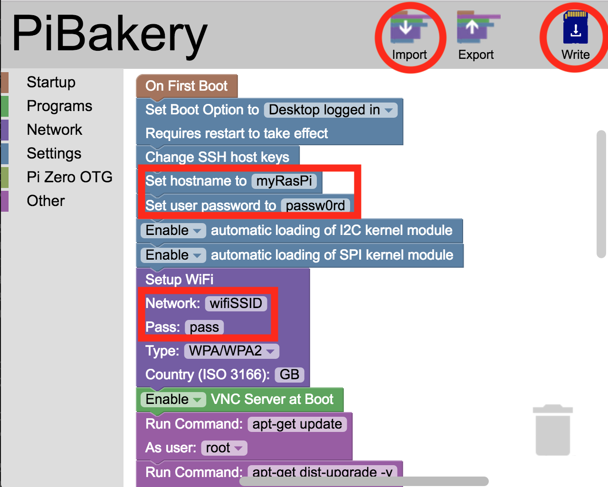

*Quick links :*
[Home](/README.md) - [**Part 1**](/part1/README.md) - [Part 2](/part2/README.md) - [Part 3](/part3/README.md)
***
**Part 1** - [**Setup**](/part1/PREREQ.md) - [Cloud](/part1/IOTCLOUD.md)
***

# Installing the prerequisite software and getting your cloud account setup

## Lab Objectives

This Lab will ensure you have all the resources and software needed to complete the workshop.  You should follow the instructions and complete all sections of the setup before moving forward with the Lab.

## Raspberry Pi development

To be able to complete the workshop you need to purchase the required hardware and install the required software on the Raspberry Pi and your laptop or workstation.  You also need an active IBM Cloud account and a suitable WiFi environment:

### WiFi

Most Raspberry Pis can connect to a 2.4GHz network supporting 802.11 b/g/n.  The very latest Raspberry Pi, version 3 model b+ can also connect to 5GHz frequencies (802.11 ac), so ensure you have a network compatible with the version of Raspberry Pi you have.

The workshop does not support advanced authentication, such as using LDAP or certificates to authenticate to the network.  You should have a network that uses an access token/password, such as WPA/WPA2 - this is what most home WiFi access points provide.

Many corporate networks are difficult to connect IoT devices to, as they can be tightly secured, often requiring certificates to be installed.

If a suitable network is not available then smart Phone hotspots can be used to provide connectivity. The workshop does not require large amounts of data for the Raspberry Pi once it is setup, so is suitable for using a phone hotspot.

There are no incoming ports needed for the workshop, but the Raspberry Pi needs to be able to connect via MQTT protocol over TCP to ports 1883 and 8883.  The workshop also need web access over TCP ports 80 and 443.  The final port that is needed is for Network Time Protocol (NTP), which uses an outbound UDP connection on port 123.

### Purchasing the required Hardware

You need to purchase the following hardware to work through the workshop.
- DHT22 sensor.  

This provides temperature and humidity readings

There are a number of version of Raspberry Pi available.  This workshop should work with all versions of the Raspberry Pi. The Recommended version is the Raspberry Pi 3 Model B or Model B+

### Hardware list

- Raspberry Pi (search for **Raspberry Pi 3 model B+**)
- MicroUSB cable or Raspberry Pi power supply
- Micro SD card, minimum 8GB (an adapter is also needed to flash the card using your laptop or workstation, this may be a micro-full size SD adapter if your laptop has an SD card slot or a USB to SD card adapter) (search for **micro SD card 8GB**).
- DHT22 Temperature / Humidity Sensor (search for **DHT22**)
- 6 x Female to Female jumper wires (search for **dupont cable f2f or f-f** - usually sold in packs of 40 cables)

## Installing the required software on your system

To be able to work with your Raspberry Pi from your laptop or workstation you may need to install additional software.  You can complete this workshop using a direct attached keyboard, mouse and monitor instead of using remote access from your laptop.

To locate your Pi on the network you can use ZeroConf services, (also called Bonjour).  This is installed by default on MacOS and most Linux distributions (including the Raspberry Pi), but additional software is needed on Windows.

Windows users should install this [additional software](https://support.apple.com/kb/dl999?locale=en_GB) to enable local name resolution between Windows and Raspbian.  (If you have Apple iTunes installed you already have this software installed as part of iTunes)  

A terminal application is also needed to access the Raspberry Pi command line.  On linux and MacOS you already have the Terminal application, but on Windows an additional application, such as [putty](http://www.putty.org) is needed.

Finally you will need to be able to access the Raspberry Pi graphical user interface, so you need to install a [VNC Viewer](https://www.realvnc.com/en/connect/download/viewer/) application.

## Pi setup and first boot

### Face to face workshop

For a face-to-face workshop you should have a Raspberry Pi that has already been setup.

You should have been notified of the hostname and password for your Raspberry Pi.  You can connect to the Raspberry Pi using zeroConf by adding **.local** to the pi hostname.  The default user name is **pi**.

### Self-setup

If you are setting up a Pi, then the recommended approach is to use [PiBakery](http://www.pibakery.org).  You need to download and install the application then launch PiBakery on your laptop and import the **ras3B-workshop.xml** file from the [scripts](../scripts) directory of this repo.  You need to change the WiFi settings and optionally change the hostname and password.  When you've made the required changes write the image to a SD card, then when finished insert the SD card into your raspberry Pi and power on.

### Ways of connecting to the Pi

Power up the Raspberry Pi by connecting the micro USB connector from a power adapter or microUSB cable connected to your laptop USB port.  Your Raspberry Pi should boot and automatically connect to the WiFi.  The first boot may take a few minutes, as additional software is installed on first boot.

In the following commands replace `<hostname>` with the hostname of your Raspberry Pi:

- Command line : in a terminal (or [putty](http://www.putty.org/) if on windows) use command `ssh pi@<hostname>.local`
- [VNC](https://www.raspberrypi.org/documentation/remote-access/vnc/) : Launch the application and enter `<hostname>.local` as the Raspberry Pi server name
- Node-RED : In a browser enter `http://<hostname>.local:1880` as the URL

***
*Quick links :*
[Home](/README.md) - [**Part 1**](/part1/README.md) - [Part 2](/part2/README.md) - [Part 3](/part3/README.md)
